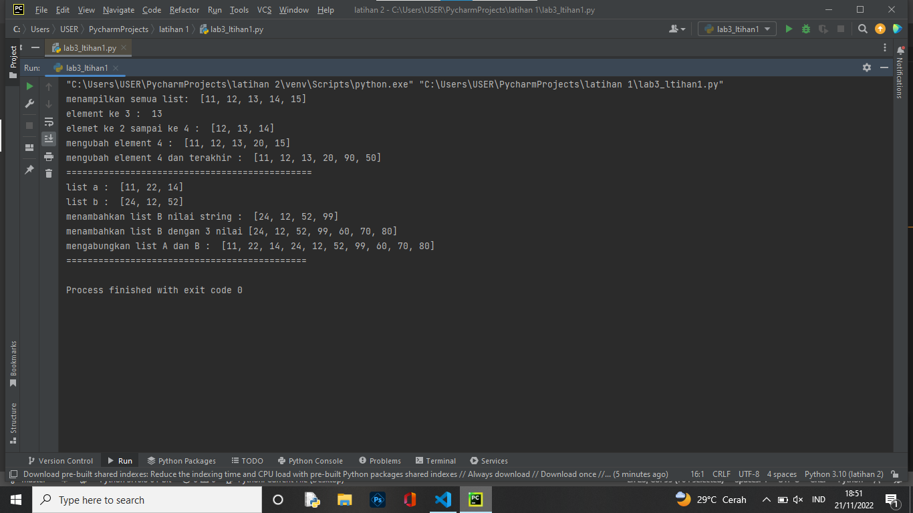
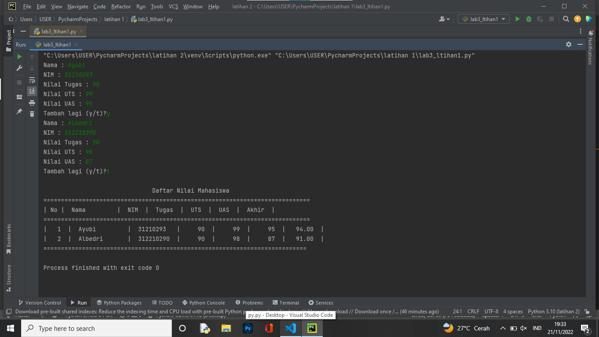

# praktikum4
# Nama : Muhammad Din Al Ayubi
# NIM :312210293
# Kelas : TI 22 A3

## Latihan
## Source Code
```python
# mdinalayubi
#Akses pada list
data = [11,12,13,14,15]
print ("menampilkan semua list: ", data[0:6])
print ("element ke 3 : ", data[2])
print ("elemet ke 2 sampai ke 4 : ", data[1:4])
#mengubah element list
data[3] = 20
print("mengubah element 4 : ", data)
data[4:5]  = 90,50
print("mengubah element 4 dan terakhir : ", data)
print("==============================================")
#menambahkan element
dataa = [11,22,14]
datab = [24,12,52]
print("list a : ", dataa)
print("list b : ", datab)
datab.append(99)
print ("menambahkan list B nilai string : ", datab)
datab.extend([60,70,80])
print("menambahkan list B dengan 3 nilai", datab)
print("mengabungkan list A dan B : ",dataa + datab)
#terimakasih
print("=============================================")
```
## Hasil Latihan


## Praktikum
## Source Code
```python
# mdinalayubi
data = []

while True:
    nama = input("Nama : ")
    nim = input("NIM : ")
    tugas = int(input("Nilai Tugas : "))
    uts = int(input("Nilai UTS : "))
    uas = int(input("Nilai UAS : "))
    akhir = float(tugas * 30 / 100) + (uts * 35 / 100) + (uas * 35 / 100)
    data.append ([nama, nim, tugas, uts, uas, int(akhir)])
    lagi = input ("Tambah lagi (y/t)?")
    if lagi.lower() =="t":
        break

print("\n                               Daftar Nilai Mahasiswa")
print("============================================================================")
print("| No |  Nama         |  NIM  |  Tugas  |  UTS  |  UAS  |  Akhir  |")
print("============================================================================")
i = 0
for nilai in data:
    i += 1
    print("|  {no:2d}  |  {nama:12s}  |  {nim:9s}  |  {tugas:5d}  |  {uts:5d}  |  {uas:5d}  |  {akhir:6.2f}  |" .format(no=i, nama=nilai[0], nim=nilai[1], tugas=nilai[2], uts=nilai[3], uas=nilai[4], akhir=nilai[5]))

print("===========================================================================")
```
## Hasil Praktikum

## Penjelasan
1. Pertama Kita membuat variabel kosong. data = [] ulang = true
2. Lalu kita membuat kondisi perulangan dan statement yang akan dijalankan ketika perulangan terjadi.
3. Setelah membuat perulangan, kita membuat statement untuk menghentikan atau keluar dari perulangan yang terjadi.
4. terakhir kita akan mencetak hasil dari program yang telah dibuat.